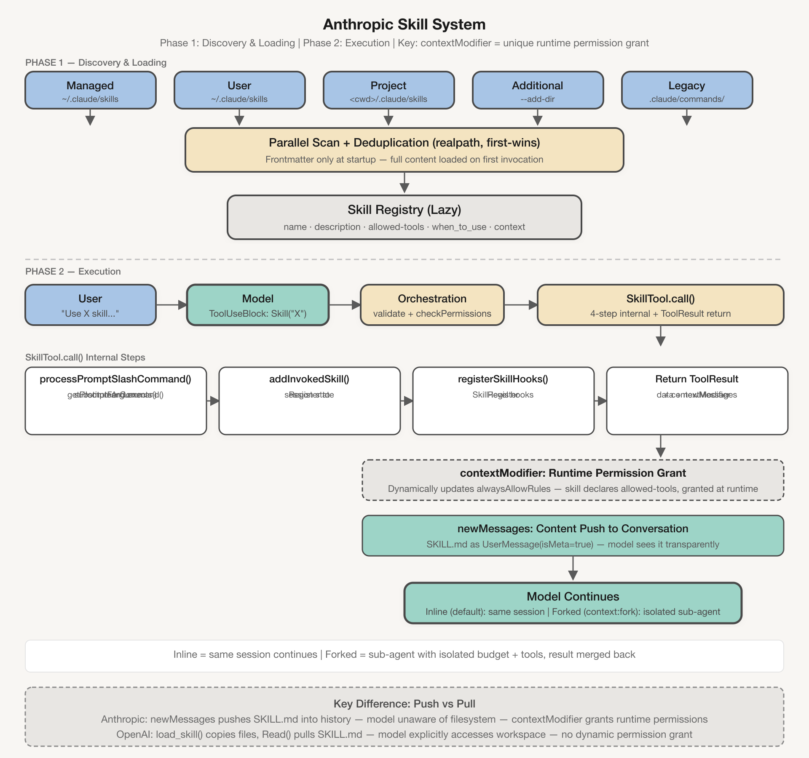
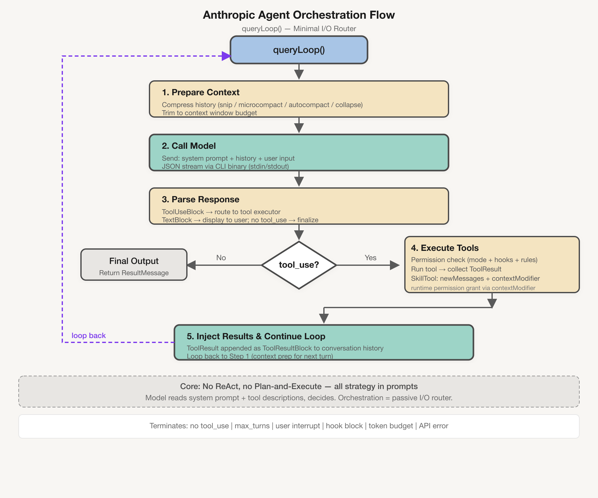
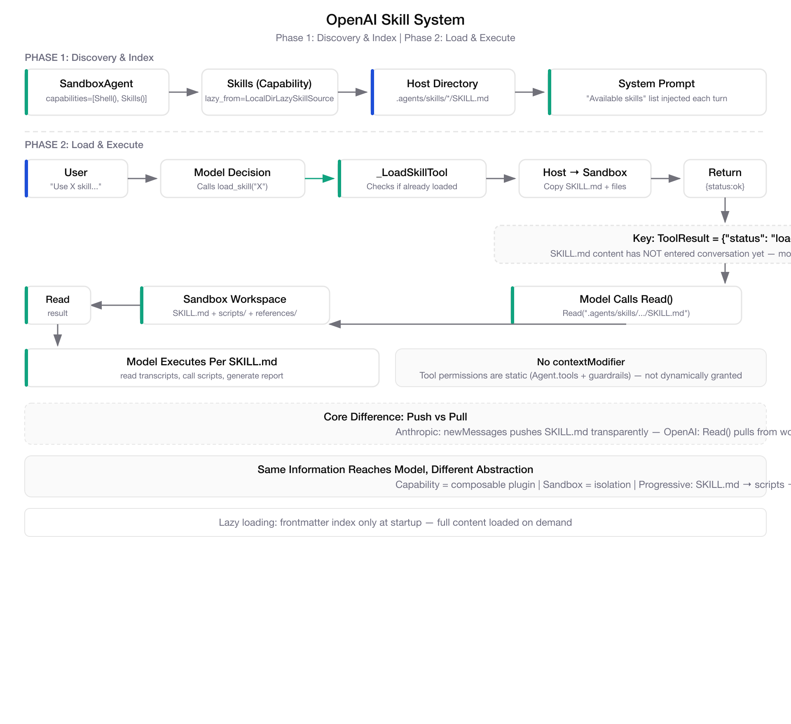
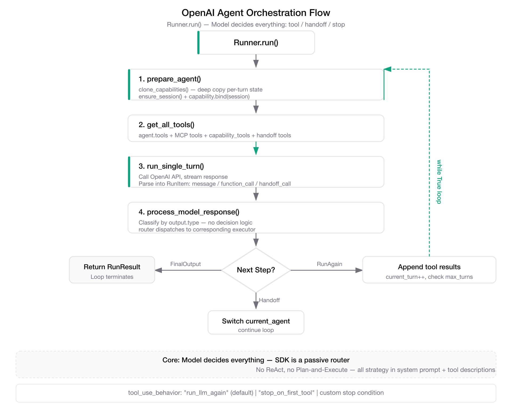

2026 年 4 月 15 日，OpenAI 发布 Agents SDK v0.14.0，引入了 `SandboxAgent` + `Capabilities` 架构。本地 Skill 加载（`Skills` Capability、`LocalDirLazySkillSource`、`load_skill` 工具）终于成为了 SDK 一等公民。这条路 Anthropic 走了好几年，现在两家殊途同归。

这件事值得认真写一篇——不是因为"AI厂商在卷"，而是这个收敛本身说明了一个判断：**Skill 作为知识载体的价值，正在超过 Agent 运行时本身**。

## Skill 是什么

直接说结论：一段存在 SKILL.md 里的指令文本，运行时被塞进模型上下文，让模型按预定义工作流执行任务。无论 Anthropic 的 Claude Code CLI 还是 OpenAI 的 Agents SDK，Skill 的本质相同。

两家的设计范式也相同：延迟加载（只读 frontmatter，不读完整内容）、模型自主决定调用时机、无固定编排模式（没有写死 ReAct 或 Plan-and-Execute）、控制逻辑全在 prompt 里，不在代码里。

从这个角度看，两者的差异像同一个函数用不同语言实现——结果一样，路径不同。真正的差异在 **`surrounding infrastructure`**：权限模型、架构形态、扩展机制。这是设计哲学的选择，不是实现细节。

## Anthropic 的路径

### 架构：封闭的产品

Anthropic Agent SDK 是 Claude Code CLI 的薄封装，Python 层只负责启动 CLI 和转发 JSON 流，真正的编排逻辑在 CLI 内部。

```
你的代码 → Python SDK → Claude Code CLI → Anthropic API
                ↑________________________↓
                    JSON Stream 控制协议
```

这决定了它的封闭性：开发者无法直接干预编排流程，只能通过 hooks、配置文件和 prompt 间接影响。好处是内部可以做激进优化，坏处是没多少配置空间。

### Skill 加载：5 来源并行扫描，懒加载到调用时才读内容

CLI 启动时扫描 5 个来源（managed → user → project → additional → legacy），解析每个 SKILL.md 的 frontmatter 提取元信息。完整内容被闭包捕获但不处理，等到 Skill 被调用时才读。

这个设计解释了为什么 `estimateSkillFrontmatterTokens()` 只算 frontmatter 的 token——因为完整内容本来就不是提前加载的。



> Phase 1: 5 sources scan → lazy registry (frontmatter only). Phase 2: model calls Skill → SkillTool.call() → contextModifier (dynamic permission) + newMessages (push to conversation). Key: contextModifier is Anthropic's unique runtime permission grant mechanism.

### Skill 执行：编排层 push，contextModifier 动态授权

模型调用 `Skill` 工具时，编排层执行 4 步：

1. **校验与权限检查**：确认 skill 存在、未被禁用、有调用权限
2. **读取内容**：`getPromptForCommand()` 读完整 SKILL.md，替换 `$ARGUMENTS`，执行内联 shell 命令
3. **注入对话**：内容包装为 `UserMessage(isMeta=true)` 注入对话历史
4. **更新权限**：`contextModifier` 动态更新 `alwaysAllowRules`，授予 skill 声明的 `allowed_tools`

`newMessages` 和 `contextModifier` 是通用 ToolResult 字段，任何工具都能返回 `newMessages`。但整个代码库里只有 SkillTool 用 `contextModifier`——这件事本身就说明了 Skill 的特殊性：它利用这个通用接口，做了唯一专属的运行时权限授予。

### 编排循环：queryLoop 是极简的被动路由器

`queryLoop()` 的流程：上下文准备 → 调用模型 → 检测 tool_use → 执行工具 → 收集结果 → 追加历史 → 下一轮。没有 ReAct，没有 Plan-and-Execute，编排层不做"该用什么模式"的决策——模型读 system prompt 自己决定。

循环终止条件很多：模型不再输出 tool_use、达到最大回合数、用户中断、hook 阻止、token budget 耗尽、API 错误等。



> 上图展示 queryLoop() 流程：上下文准备 → 模型调用 → 响应解析 → tool_use 判断 → 工具执行 → 结果注入 → 循环。核心哲学：模型通过 system prompt + tool descriptions 自主决定行为，编排层是被动的 I/O 路由器。

## OpenAI 的路径

### 架构：开放的框架

OpenAI Agents SDK 是纯 Python 框架，没有 CLI 中间层，编排逻辑全在 Python 代码里，开发者可以直接改。

```
你的代码 → Python 库 → 直接 HTTP → OpenAI API
```

这是和 Anthropic 最根本的不同：编排流程可见、可配置、可扩展。好处是控制权大，坏处是框架没法替你做太多"黑盒优化"。

### Skill 加载：显式挂载 Capability，懒加载用 frontmatter 索引

开发者必须显式挂载 `Skills` Capability：

```python
agent = SandboxAgent(
    capabilities=[
        Skills(
            lazy_from=LocalDirLazySkillSource(source=LocalDir(src=skills_dir)),
            skills_path=".agents/skills",
        ),
    ],
)
```

`Skills.instructions()` 把 skill 索引（名称 + 描述 + 路径）注入 system prompt。完整 SKILL.md 内容不在 system prompt 里——和 Anthropic 一样是延迟加载，只是触发机制不同。



> Phase 1: Capability plugin + lazy index (frontmatter only) + system prompt injection. Phase 2: model calls load_skill() → _LoadSkillTool copies files → returns {"status": "loaded"} → model explicitly calls Read() from sandbox workspace. Key: no contextModifier equivalent — content is model-pulled, permissions are static.

### Skill 执行：模型 pull，两步流程

当模型决定使用 skill 时：

1. **调用 load_skill**：模型调用 `load_skill("xxx")` 工具
2. **文件复制**：编排层把 skill 目录从宿主机复制到 sandbox workspace
3. **返回状态**：工具返回 `{"status": "loaded"}`，模型看不到 skill 内容
4. **自主读取**：模型调用 `Read` 工具读取 `.agents/skills/xxx/SKILL.md`
5. **获取指令**：Read 返回内容，模型按指令执行

关键区别在这里：skill 内容不是编排层主动注入的，而是模型通过 Read 工具自主获取的。编排层只做了一个文件复制操作。

### 编排循环：Runner.run 同样是被动路由器

`AgentRunner.run()` 的流程：准备 agent → 收集工具 → 调用模型 → 解析响应 → 执行工具 → 决定下一步（返回结果 / Handoff / 继续循环）。和 Anthropic 的 queryLoop 本质一样：检测到 tool_use 决定 → 执行 → 把结果塞回去 → 继续循环。



> 上图展示 Runner.run() 流程：prepare_agent → get_all_tools → run_single_turn → process_model_response → 分支决策（FinalOutput / Handoff / RunAgain）。核心哲学：模型决定一切——调什么工具、何时 handoff、何时停止，SDK 只是被动路由器。

## 真正的差异在哪

两者本质相同，那差异在哪？

### 差异 1：内容交付——推送 vs 拉取

这是 Skill 机制上**唯一真正的行为差异**。

Anthropic：模型调用 Skill → 编排层读完整内容 → 通过 `newMessages` 直接注入对话 → 模型下一轮直接看到（透明，模型不知道文件系统）

OpenAI：模型调用 load_skill → 编排层只复制文件 → 返回 `{"status": "loaded"}` → 模型必须再调 Read 才能看到（显式，模型知道自己在读文件）

从信息量看两者等价，只是路径不同：一个是工具副作用路径，一个是工具返回值路径。这个差异的本质是内容交付的抽象层级不同，不是控制权不同。

### 差异 2：权限模型——运行时授予 vs 静态定义

这是架构层面的真正差异。

Anthropic 的 Skill 可以在 frontmatter 声明 `allowed_tools`，调用后通过 `contextModifier` 动态更新 `alwaysAllowRules`。同一 agent 在不同 skill 调用期间可以拥有不同工具权限，权限与 skill 生命周期绑定，对模型透明——模型不需要知道权限变了，只管调用工具，权限检查在编排层自动处理。

OpenAI 没有等价的运行时权限授予机制。工具权限由 `Agent.tools` 和 guardrails 静态定义，agent 的工具集在创建时确定。guardrails 可以限制工具使用，但不支持 skill 级别的动态授权。

这个差异的本质是：Anthropic 把权限视为 skill 的副作用，OpenAI 把权限视为 agent 的静态属性。不是实现方式不同，是安全模型的根本选择。

### 差异 3：架构形态——产品 vs 框架

这是最显著的差异，也是其他差异的根因。

Anthropic 走封闭产品化路线：编排逻辑在 CLI 二进制内部，Python SDK 只负责转发，开发者无法直接修改编排行为。好的一面是可以做激进的内部优化（自定义上下文压缩、工具分区），坏的一面是没配置空间。

OpenAI 走开放框架化路线：编排逻辑全在 Python 代码，开发者可以直接改 agent 配置、覆盖默认行为、组合 Capability。控制权大，但框架没法替你做太多黑盒优化。

这是产品化和框架化的取舍。Anthropic 像一个开箱即用的产品，OpenAI 像一个灵活组合的框架。

### 差异 4：扩展机制——Hook 事件 vs Capability 插件

Anthropic 用 Hook 系统：关键节点（PreToolUse、PostToolUse、Stop 等）触发事件，外部逻辑通过事件处理器注入。事件驱动，适合在已有流程中插入逻辑。

OpenAI 用 Capability 插件：Skills、Shell、Filesystem 都是 Capability，每个提供统一接口（`tools()`、`instructions()`、`process_manifest()`）。接口驱动，适合组合新的能力。

两者没有高下之分，只是抽象方式适合不同场景。

### 差异 5：子 Agent——嵌套隔离 vs 状态切换

Anthropic 的 AgentTool 触发 `runAgent()`，创建独立的子会话（独立上下文状态、readFileState、abortController、工具权限），父会话等待子会话完成后合并结果。真正的嵌套隔离——新进程 + 独立状态，不是变量替换。

OpenAI 的 Handoff 切换 `current_agent` 变量，在同一会话中继续执行，没有独立的会话生命周期。状态切换，不是嵌套。

前者适合强隔离场景，后者适合共享上下文场景。

## 有些事不是差异

有些之前被列为"差异"的地方，本质相同：

懒加载不是 OpenAI 独有的。Anthropic 也是启动时不读完整 SKILL.md，只是用闭包捕获内容，OpenAI 用 frontmatter 索引——都是延迟加载。

渐进式披露也不是 OpenAI 独有的。Anthropic 的 skill listing 也只含 frontmatter，不含完整内容，两者都是调用后才暴露完整内容。

循环核心也一样。两者都是 `while true + tool-use` 循环，不是差异。

挂载方式和执行隔离也不是机制差异——CLI 自动扫描 vs 代码显式挂载是配置方式不同，Fork vs Sandbox 是隔离层级不同。

## 小结

两者本质相同：Skill 是一段 SKILL.md 文本，延迟加载到模型上下文；编排哲学是极简循环加模型自主 tool-use；决策主体是模型，不是代码。

真正不同的就一件事——**设计哲学导致的基础设施选择**：

| | Anthropic | OpenAI |
|---|-----------|--------|
| 内容交付 | 推送（newMessages 注入） | 拉取（Read 从 workspace 读） |
| 权限模型 | 运行时动态授予 | 静态定义 |
| 架构形态 | CLI 中间层，封闭 | 纯 Python，开放 |
| 扩展机制 | Hook 事件系统 | Capability 插件 |
| 子 Agent | 嵌套隔离 | 状态切换 |

Anthropic 选了封闭产品化路径，OpenAI 选了开放框架化路径。两条路都走得通，代价不同，适合不同场景。

---

## 参考

- [Anthropic — Agent SDK Overview](https://platform.claude.com/docs/en/agent-sdk/overview)
- [From Custom Agents to Agent Runtime + Skill: Convergence in AI System Architecture](https://kingson4wu.github.io/en/blog/agent-runtime-and-skill-convergence/)
- [OpenAI — The Next Evolution of the Agents SDK](https://openai.com/index/the-next-evolution-of-the-agents-sdk/)
- [OpenAI Agents SDK — Sandboxes](https://developers.openai.com/api/docs/guides/agents/sandboxes)
